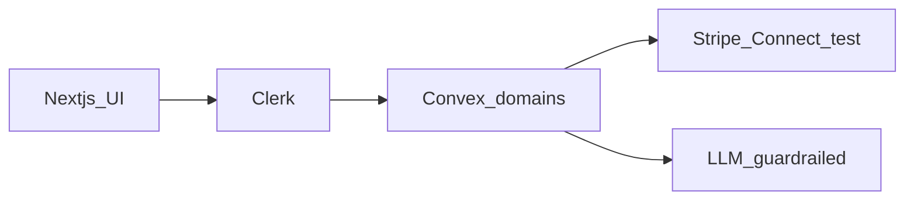

# RentaMart Design Spec

**Date:** 2026-07-13  
**Status:** Draft for review  
**Product:** RentaMart  
**Repo:** https://github.com/ankitpatil3003/RentaMart

---

## 1. Product summary

RentaMart is a US-only hybrid rental marketplace: a public renter-facing search and apply flow, plus landlord/org operations. Screening stays stub/sandbox for this product. Payments use Stripe **test mode** for demos and E2E. The UI stays simple and one-job-per-screen. Product and docs carry no funding narrative.

### Delivery layers

| Layer | Scope |
| ----- | ----- |
| **1** | Renter: search, listing detail, apply, application fee, application status, AI search/Q&A (grounded, feature-flaggable) |
| **2** | Landlord: org + Stripe Connect, listings (self-serve + admin seed), review/approve-deny, deposit + first month via Connect, RBAC, AI screening assist (no decisions) |
| **3** | Messaging, rent schedule, maintenance |

Hard gate: no Next.js/Convex app scaffolding until the Layer 1 implementation plan is approved. Spec and plans only until then.

---

## 2. Locked decisions

- **Name:** RentaMart
- **Market:** United States only
- **Shape:** Hybrid product; build renter → landlord → messaging/ops
- **Stack:** Next.js + Convex + Clerk + Stripe Connect
- **Architecture:** Modular monolith; payment and AI discipline from day one
- **Payments:** Application fee → platform; deposit + first month → Connect; webhook = truth; idempotent ledger
- **Screening:** Stub/sandbox forever for this product; vendor-shaped interface so a real CRA can plug in later
- **Listings:** Platform admin seed + landlord self-list (stricter publish checks for self-serve)
- **AI:** Search/Q&A + screening assist only; never money, auth, publish, or approve/deny
- **UX:** Simple for new users; one job per screen
- **Cost:** Free tiers + OSS; do not swap Clerk/Convex/Stripe for savings at demo scale
- **Copy:** No funding language in docs or product copy
- **Commit hygiene:** No em dash in commit messages; no agent co-author trailers; no hand-edits to auto-generated changelogs

---

## 3. Explicitly deferred

These are intentional deferrals, not gaps:

- Exact visual brand, fonts, and colors
- Map provider choice (map is optional after Layer 1)
- Production Stripe live mode
- Real consumer-reporting vendor
- Mobile native apps
- Multi-country support

---

## 4. Architecture

Modular monolith on Convex domains with a Next.js App Router UI and Clerk for identity.

### Domains

| Domain | Responsibility |
| ------ | ---------------- |
| `listings` | Public and org-scoped listings, filters, photos (Convex file storage URLs) |
| `orgs` | Organizations, membership, Connect account linkage, publish readiness |
| `applications` | Application lifecycle and status machine |
| `payments` | Checkout sessions, webhook handling, idempotent ledger |
| `screening` | Stub/sandbox screening adapter (vendor-shaped) |
| `ai` | Grounded search/Q&A and screening assist DTOs; feature-flagged |

### System context



### Cross-cutting rules

- **Webhooks own payment success.** UI never marks a payment paid on its own.
- **Clerk identity + Convex RBAC.** Roles live in Convex; Clerk proves who you are.
- **AI returns DTOs only.** No side effects that change money, roles, publish state, or approve/deny.
- **HTTP actions** for Stripe webhooks; store `stripeEventId` for dedupe.

---

## 5. Application status machine (Layers 1–2)

```
draft
  → submitted
  → fee_pending
  → fee_paid | fee_failed
  → under_review
  → approved | denied
  → (if approved) deposit_due
  → deposit_paid
  → first_month_due
  → first_month_paid
  → move_in_ready
```

**Terminal for that application:** `denied`, and canceled (if introduced as a cancel path).  
Layer 1 owns through `fee_paid` / `fee_failed` and presentation of status. Layer 2 owns review, approve/deny, and deposit/first-month transitions.

---

## 6. Money model

### Payment types

| Type | Destination | Typical trigger |
| ---- | ----------- | --------------- |
| `application_fee` | Platform Stripe account | After submit |
| `deposit` | Org Connect account | After approve |
| `first_month` | Org Connect account | After deposit paid |

### Idempotency

Business idempotency keys (examples):

- `appfee:{applicationId}`
- `deposit:{applicationId}`
- `first_month:{applicationId}`

Ledger rows in Convex record intent, Stripe references, status, and `stripeEventId` for webhook dedupe. Replaying the same webhook must not double-apply ledger effects.

### Connect readiness

Publishing listings and collecting deposit/rent require the org Connect account to be ready in **test** mode. Layer 2 enforces this in RBAC/publish gates.

---

## 7. Auth and RBAC

### Roles

| Role | Intent |
| ---- | ------ |
| `renter` | Search, apply, pay application fee, view own application status |
| `org_owner` | Full org control, Connect onboarding, publish, approve/deny |
| `leasing_agent` | Org-scoped review and listing ops per org policy |
| `platform_admin` | Seed data, cross-org admin tools, demo paths |

Identity comes from Clerk. Authorization decisions run in Convex (custom wrappers / shared auth helpers). Never trust client-sent role claims alone.

---

## 8. Search and listings (Layer 1 defaults)

- **Search UX default:** List-first with plain filters: location, price, beds. Map is optional later; not required for Layer 1.
- **Listing detail:** Photos, rent, beds/baths, location summary, apply CTA.
- **Media:** Listing photos via Convex file storage; store URLs on the listing. Seed may use placeholders.
- **Sources:** Admin/demo seed plus (Layer 2) landlord self-list with stricter publish checks.

---

## 9. Screening (stub forever for this product)

- Interface is vendor-shaped (request/response DTOs, status, report summary fields).
- Implementation is stub/sandbox only for RentaMart as specified.
- AI may summarize stub results, flag missing docs, or suggest questions.
- AI must not approve, deny, or change application status.

---

## 10. AI guardrails

### Allowed

- Natural language → search filters / explanations
- Listing Q&A grounded on a listing snapshot
- Screening assist: summarize, missing docs, follow-up questions

### Banned

- Payments and ledger writes
- Role changes
- Publish / unpublish
- Approve / deny applications
- Any auth bypass

### Ops defaults for demos

- LLM: Groq free tier and/or Ollama local
- Feature-flag AI **off** without breaking apply/pay paths
- Optional env only (never required for core Layer 1 money path)

---

## 11. Demo seed

A `platform_admin` seed script/mutation should create:

- Sample orgs (Connect-ready in Stripe test)
- Sample listings (with placeholder media if needed)
- One demo renter path usable in E2E (search → apply → fee)

Secrets stay out of the repo; seed uses test-mode Stripe and local env.

---

## 12. Secrets and environment

- Never commit real secrets.
- Ship `.env.example` only when scaffolding starts: Clerk, Convex, Stripe test keys, optional LLM/Groq.
- Local Stripe CLI for webhook forwarding in E2E.
- Convex HTTP action endpoint receives Stripe webhooks; verifies signature; dedupes on `stripeEventId`.

---

## 13. README expectations (when scaffolding starts)

Document:

1. Clone and install
2. Env vars from `.env.example`
3. Run web app + `npx convex dev`
4. Stripe test mode + Stripe CLI webhook forward
5. Playwright E2E golden path
6. No real secrets in docs or screenshots

Use `npx convex dev` for development. `npx convex deploy` is production-only.

---

## 14. Quality bar

### E2E golden path (Layers 1–2)

1. Search → apply → application fee (webhook) → assert UI + ledger  
2. Landlord approve → deposit + first month (webhook) → assert UI + ledger  
3. Webhook replay: same event twice → ledger remains idempotent  

### Engineering rules

- Bugfixes start from an E2E reproduction when the bug is user-path related
- Lint failures and flaky E2E are blockers
- UI pickiness is allowed during E2E (assert what users see)
- Prefer indexes over full-table filters in Convex
- All public Convex functions validate args/returns and check auth where user data is involved

---

## 15. Cost and open source posture

| Target | Notes |
| ------ | ----- |
| **$0–5/month** | Stub/sandbox on free tiers |
| **Optional $15–40/month** | Domain + LLM credits if desired |

- Keep Clerk, Convex, Stripe on free/test tiers at demo scale; do not swap them for “savings”
- OSS for app code, Playwright E2E, optional Ollama
- Do not cut ledger, RBAC, or E2E to save money

### Rough build-time estimates (part-time)

- Layer 1: ~3–6 weeks  
- Layer 2: ~4–8 weeks  
- Layer 3: ~3–6+ weeks  

---

## 16. Git and delivery workflow

1. Feature branch → PR into `develop`  
2. After Layer testing on `develop` → PR `develop` → `main`  
3. No direct feature pushes to `main`  
4. Commit messages: no em dash; no agent co-author; no hand-edit of auto-generated changelogs  

---

## 17. Layer boundaries (for later plans)

### Layer 1 (next plan after this spec is approved)

- Scaffold Next.js + Convex + Clerk (only after Layer 1 plan approval)
- Public list-first search + filters + listing detail
- Apply flow + application fee (platform) + webhook ledger
- Application status UI through fee outcomes
- Feature-flagged AI search/Q&A
- Seed + Playwright path for search → apply → fee
- `.env.example` + README setup

### Layer 2

- Orgs, Connect onboarding (test), RBAC
- Landlord listing self-serve + publish gates
- Review → approve/deny
- Deposit + first month via Connect + webhooks
- Screening stub UI + AI assist (no decisions)
- E2E extended through deposit/first month + replay

### Layer 3

- Messaging
- Rent schedule
- Maintenance

---

## 18. Out of scope for this document

Implementation file lists, exact component trees, brand tokens, and task-by-task coding steps belong in Layer implementation plans (`docs/superpowers/plans/`), not in this design spec.

---

## 19. Review checklist for approvers

- [ ] Product name, layers, and stack match intent  
- [ ] Status machine and payment types are correct  
- [ ] Webhook-as-truth and idempotency are non-negotiable  
- [ ] Stub screening + AI bans are clear  
- [ ] Cost/OSS posture and free-tier stack are accepted  
- [ ] Hard gate understood: no app scaffolding until Layer 1 plan is approved  

**Next agent step after approval:** invoke writing-plans for **Layer 1 only**.
